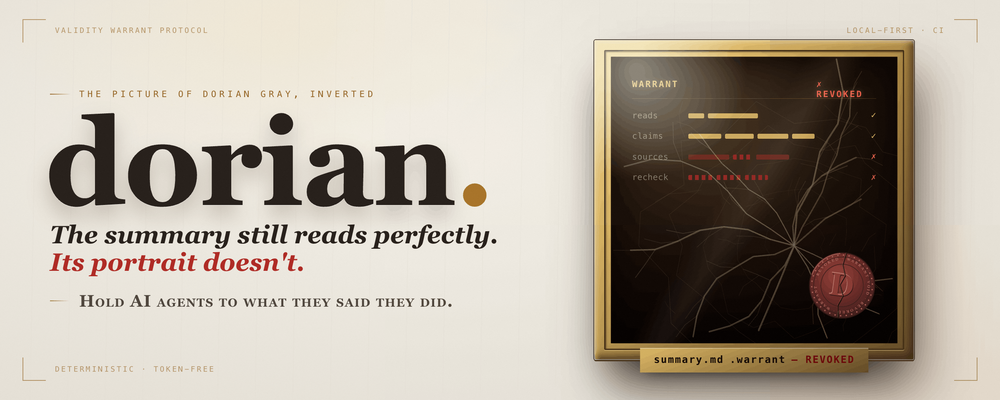

<div align="center">

<picture>
  <source media="(prefers-color-scheme: dark)" srcset="docs/assets/dorian-hero.png">
  <source media="(prefers-color-scheme: light)" srcset="docs/assets/dorian-hero-light.png">
  
</picture>

# dorian

**Hold AI agents to what they said they did.**

*The summary still reads perfectly. Its portrait doesn't.*

<p>
  <a href="#getting-started"></a>
  <a href="#try-it-in-30-seconds"></a>
  <a href="action/README.md"></a>
</p>

<p>
  <a href="https://github.com/ajaysurya1221/dorian/actions/workflows/ci.yml"></a>
  
  
  <a href="https://github.com/ajaysurya1221/dorian/releases/latest"></a>
</p>

</div>

An AI agent says it *added rate-limiting to `/login`, set the timeout to 30s, and updated every
caller.* Some of that is already false; the rest goes false on the next commit — and CI stays green
the whole time. `dorian` turns each checkable claim into a deterministic, token-free check that holds
now and is re-checked on every future change, so a confident summary doesn't quietly become a lie.

> **Local-first and token-free.** dorian runs offline against your git repo — a CLI and your
> commits, nothing else — with **zero model tokens at check time**, so the checker can't be talked
> past by the code it verifies. Because checker programs are *executable* (C4 runs `pytest`, C5
> `shell:` runs a command), it is built for **trusted, internal repositories** — not public CI
> taking forked pull requests by default (for public/fork PRs, `checker_trust: base` runs only
> base-approved checker specs — a trust root, still not a sandbox). Pairs naturally with a coding
> agent such as **Claude Code** ([how](#using-dorian-with-claude-code)).

## Table of contents

- [Try it in 30 seconds](#try-it-in-30-seconds)
- [The 60-second aha](#the-60-second-aha)
- [We ran this on dorian itself](#we-ran-this-on-dorian-itself)
- [About](#about)
- [Who verifies the verifier?](#who-verifies-the-verifier)
- [Why not just watch files?](#why-not-just-watch-files)
- [How it works](#how-it-works)
- [Using dorian with Claude Code](#using-dorian-with-claude-code)
- [What gets committed](#what-gets-committed)
- [Getting started](#getting-started)
- [Writing claims an agent can be held to](#writing-claims-an-agent-can-be-held-to)
- [Command surface](#command-surface)
- [Claim extraction is frozen](#claim-extraction-is-frozen)
- [What dorian is not](#what-dorian-is-not)
- [Roadmap](#roadmap)
- [Contributing](#contributing)
- [License](#license)
- [Contact](#contact)

## Try it in 30 seconds

A self-contained run on a throwaway repo — copy-paste it; it leaves nothing behind but a
temp directory. (This exact sequence is pinned by a black-box test, so it is executable and
kept working, not just illustrative.)

```bash
tmp=$(mktemp -d) && cd "$tmp" && git init -q
printf 'def handler():\n    return 200\n' > app.py
printf '# change note\n\n`handler()` lives in app.py.\n' > note.md
git add -A && git commit -q -m "app + note"

cat > claims.json <<'JSON'
{"claims": [
  {"id": "handler-exists", "text": "handler() lives in app.py.",
   "kind": "behavior", "load_bearing": true,
   "checkers": [{"type": "C3", "program": "symbol:app.py::handler"}]}
]}
JSON

dorian verify note.md --claims claims.json     # -> verified 1/1 claim(s)  (exit 0)

# now a refactor renames the function the note claims exists:
printf 'def renamed():\n    return 200\n' > app.py
dorian revalidate --since HEAD                 # -> handler-exists BROKEN; WARRANTED -> REVOKED  (exit 4)
```

`note.md` never changed and `git`/CI stay quiet — but the warrant flips to REVOKED, naming
the exact claim that stopped being true. (Don't have `dorian` yet? See
[Getting started](#getting-started).)

## The 60-second aha

*(Illustrative — these files are not in your checkout; run the copy-paste demo above to try it
yourself.)* An agent finishes a change and emits the claims it just made — a `claims.json` next to
the work, each claim bound to a read-only deterministic checker:

```json
{
  "claims": [
    { "id": "login-ratelimit-added", "text": "Rate limiting guards the /login route.",
      "kind": "behavior", "load_bearing": true,
      "checkers": [{ "type": "C3", "program": "symbol:src/api/auth.py::rate_limit" }] },
    { "id": "login-timeout-30s", "text": "The login request timeout is 30 seconds.",
      "kind": "quantity", "load_bearing": true,
      "checkers": [{ "type": "C3", "program": "regex:src/api/config.py::LOGIN_TIMEOUT\\s*=\\s*30\\b" }] }
  ]
}
```

`dorian verify` binds each claim to its checker, auto-captures the files those checkers read, and
seals a `.warrant` — but only because every claim holds against the **real, current** code:

```text
$ dorian verify docs/changes/login.md --claims claims.json
sha256:7920c71b5a6a9c8e2b53e401c78db88af9a30c7a2f5f2f8063d7d40809866102
verified 2/2 claim(s) against current sources -> docs/changes/login.md.warrant
# exit 0 — born verifiable: had any claim been false now, the seal is refused (exit 4) and nothing is written
```

Weeks later a refactor renames `rate_limit` and drops the timeout to 10. `docs/changes/login.md` is
untouched, so git, the diff, and CI all stay silent. `dorian revalidate` re-checks **only the two
claims whose files changed** — deterministically, with zero model tokens — and is not silent:

```text
$ dorian revalidate --since main~20
checked 2 candidate claim(s)
BROKEN    sha256:7920c71b5a6a9c8e login-ratelimit-added  C3: symbol_missing
BROKEN    sha256:7920c71b5a6a9c8e login-timeout-30s  C3: regex_missing
fold      sha256:7920c71b5a6a9c8e WARRANTED -> REVOKED
# exit 4 — a load-bearing claim is now false
```

The summary still reads perfectly. Its portrait flipped to **REVOKED** — and every artifact whose
warrant was built on it is flagged `recalled`, so nobody builds on a claim that silently went false.

> **Trust states.** A warrant is born **WARRANTED**. Each `revalidate` folds it to **TRUSTED**
> (all re-checked claims hold), **DEGRADED** or **REVOKED** (a claim broke — DEGRADED for a
> non-load-bearing break, REVOKED for a load-bearing one), or **UNKNOWN** (a checker could not
> run — ERROR is never silently green and never counted as broken). So `WARRANTED -> REVOKED`
> above is the born state folding on its first revalidation.

## We ran this on dorian itself

The `verify` and `revalidate` output above is exactly what dorian prints, shown for an illustrative
`/login` change. The mechanism is no mock-up — we ran it on **dorian's own repository**: `dorian
verify` sealed five true claims about dorian's code (e.g. that `cmd_verify`
and `referenced_paths` exist) — `verified 5/5 claim(s)`, exit 0 — and then renaming a symbol one of
those claims named made `dorian revalidate` flag exactly that claim `BROKEN` and fold the warrant to
`REVOKED` (exit 4), leaving the other four `VERIFIED`. That was a throwaway demo on a real repo — not
a committed artifact and not a benchmark figure — but it is evidence that the mechanism can catch
this kind of checked break on real code, for zero model tokens.

We have since recorded a **documented, reproducible cross-PR catch on a public repo**. A
load-bearing claim sealed against [`encode/httpx`](https://github.com/encode/httpx) at one
commit — `requires-python` is `">=3.8"` — was flipped `WARRANTED → REVOKED` (exit 4) by a real
*later* upstream PR ([#3592](https://github.com/encode/httpx/pull/3592), "Drop Python 3.8
support", which moved it to `">=3.9"`), while httpx's own test suite stayed green (no test
references `requires-python`) and no stateless per-PR review bot would have re-opened the
original claim. The full command output and a from-scratch reproduction on the public repo are
in [`docs/REAL_CATCH_LOG.md`](docs/REAL_CATCH_LOG.md) — one documented catch, with honest
scope, not a validation claim.

## About

An AI agent writes the code and then a confident account of what it did — a PR description, a commit
message, a design note: *"added rate-limiting to `/login`," "the timeout is 30 seconds now," "updated
all callers," "schema bumped to 1.3."* Some of those claims are wrong the moment they're written;
others are true today and go silently false on the next edit. Either way the summary keeps reading
perfectly, the diff looks plausible, and CI is green — so nobody finds out.

That is *The Picture of Dorian Gray*, inverted: the summary is Dorian's ever-youthful portrait,
untouched while the code rots beneath it. `dorian` gives that summary a **portrait in the attic**.
For each checkable claim, you (or your agent) emit a `claims.json` binding the claim to a read-only
deterministic **checker** — C1 (span), C3 (path / symbol / string / regex), C4 (pytest), or C5 (typed
data) — and run `dorian verify`. It auto-captures the files each checker reads, runs every one against
the real current sources, and seals a content-addressed `.warrant` sidecar next to the artifact. It is
**born verifiable**: the seal happens only if every backed claim holds (exit 0), and is refused —
writing nothing — if any claim is already false (exit 4).

From then on, when sources change, `dorian revalidate` re-checks only the claims whose watched files
drifted — deterministically, with **zero model tokens** — and folds the warrant to REVOKED the instant
a claim stops being true, naming the exact claim that broke and recalling every downstream artifact
built on it. The artifact stays pristine; the `.warrant` is where the rot shows.

It is **local-first** (a CLI and a git repo, nothing else), **git-native** (sidecars are committed
beside the artifacts they warrant), and has **zero runtime dependencies**.

## Who verifies the verifier?

As models get cheaper and write more of the code, the confident summary is the easy part — the scarce
thing is cheap, deterministic ground truth that holds *without* a model. `dorian` runs zero model
tokens at check time precisely so it can't be obsoleted by the model it is checking: the one thing a
smarter, cheaper LLM still can't be is its own trustworthy external verifier (LLMs are
[empirically often worse at verifying than at solving](https://arxiv.org/abs/2402.08115)). So an
independent, deterministic, token-free checker tends to get **more** valuable the more code agents
write, not less. That is a tendency, stated as a tendency — but it is why dorian is built around a
checker the model can't talk its way past, rather than another model in the loop.

## Why not just watch files?

A file watcher alarms whenever any supporting file changes — but support files are touched constantly
by refactors, formatting, and adjacent features, and most of those changes don't falsify anything the
artifact says. (Re-reading the diff with another model has the opposite problem: it burns tokens on
every PR and still can't reliably verify itself.) `dorian` checks **claims, not files**: an alarm
means a specific sentence stopped being true.

On the v0.7.0 large controlled-mutation benchmark — 240 (artifact, mutation) pairs over six invented,
synthetic fixture domains (Python/CSV/JSON/YAML/package-metadata/SQL), 16 warranted artifacts, 53
claims, with **known-truth** labels (each label is a mechanical consequence of the edit, not a review
judgment) — claim-level revalidation flagged broken claims at precision **0.93** / recall **0.93**,
versus three file-change watchers all at recall 1.00 but precision **0.34** (naive), **0.56**
(path-scope), and **0.59** (line-aware). That is an **11.6x false-positive reduction** versus the
path-scope watcher (58 → 5 false alarms) and **10.4x** versus the stronger line-aware watcher (52 → 5)
— at a recall cost from substring-scan misses the benchmark records honestly. (The baselines hit recall
1.00 by construction here; the meaningful axis is their precision.)

These numbers describe a synthetic fixture suite, not your repository, and are not a universal
performance claim. The headline figures were **measured at v0.7.0** and are **historical**; the
current version reproduces them unchanged (240 pairs, P=R=0.93) — see the version-stamped
[`docs/BENCHMARK_CURRENT.md`](docs/BENCHMARK_CURRENT.md). See
[`docs/BENCHMARK_v0.7.0.md`](docs/BENCHMARK_v0.7.0.md) (protocol:
[`docs/BENCHMARK_PROTOCOL_v0.7.0.md`](docs/BENCHMARK_PROTOCOL_v0.7.0.md)); reproduce with
`dorian bench large-mutation`, and measure your own repos with the harness in `bench/`.

## Binding is a re-check trigger, not a behavior proof

When a claim mentions a Python symbol defined in exactly one file, `dorian` also **watches that
defining file** — so a change there *re-checks* the claim, even when no checker named that file. This
closes a silent-skip gap, but it is the honest half of the story: **binding widens when a claim is
re-checked; the checker still decides whether it's true.** A watched file changing never makes a claim
`BROKEN` by itself.

The binding-lifecycle benchmark measures exactly that split over **808 (artifact, mutation) pairs**
across 63 invented domains, with two mechanically-frozen labels per edit — *should re-check* and
*should alarm*:

- **Re-check (trigger) coverage** rose from **0.54** selection recall for a pre-binding,
  checker-path-only watcher to **1.00** for binding — it re-checks **286** stale-trigger pairs the
  old watcher silently skipped — and it does so at higher precision (**1.00**) than the rejected
  "watch any file containing the token" shortcut (**0.92**).
- **Alarm (truth) precision stayed 1.00** (zero false `BROKEN` over all 808 pairs): the extra
  re-checks from benign churn pass quietly; `ERRORED` is reported separately and is never an alarm.
- **The ceiling is shown, not hidden.** On a "gutted-body" edit (the symbol still exists, its
  behavior changed), the binding fires the re-check but an existence checker yields **zero** `BROKEN`
  — only a behavior checker (a `pytest:` test) on the same edit catches it. Binding is trigger
  coverage, **not** behavior proof.
- **Ambiguity is skipped, not guessed.** A symbol defined in more than one file is left unwatched
  (a wrong watch is a false alarm); the benchmark scores that as an honest miss rather than crediting
  it as a win.

We also reproduced **public, still-open problem classes** offline as hermetic fixtures (the public
issue is the template; the fixture is invented). Of three reproductions: a renamed config filename
left in the docs and a flipped `InsecureSkipVerify` TLS flag both fold `BROKEN` (**solved**); a major-
version API rename is caught while a same-name return-type change on a sibling is **missed** — the same
trigger-vs-truth ceiling, on a real class (**partial**). Two further cases (documented from public
sources, not reproduced) are honest misses (**not_solved**). These are scoped reproductions of public
problem classes — not universal validation.

The 808-pair figures above were **measured at dorian 0.9.0** and are **historical**; the
current-version rerun (same protocol) is in [`docs/BENCHMARK_CURRENT.md`](docs/BENCHMARK_CURRENT.md).
See [`docs/BENCHMARK_BINDING_LIFECYCLE.md`](docs/BENCHMARK_BINDING_LIFECYCLE.md) and
[`docs/REALWORLD_USECASES.md`](docs/REALWORLD_USECASES.md) (protocols alongside each); reproduce with
`dorian bench binding-lifecycle` and `dorian bench realworld-usecases`.

## How it works

1. **Write `claims.json`** — your agent emits it as it works, or you write it by hand
   (see [`docs/AGENT_CLAIMS.md`](docs/AGENT_CLAIMS.md)).
2. **`dorian verify`** — one shot: auto-capture the read-set from each claim's checker, then seal.
   Every checker must pass at seal time, so warrants are born verifiable.
3. **`dorian revalidate`** when sources change — only claims whose watched files drifted are
   re-checked, with zero model tokens.
4. **Inspect** — broken claims, trust-state transitions, the audit trail, and the blast radius of
   downstream artifacts.

```bash
# the one-shot loop: emit claims.json, then verify it against the current code
dorian verify docs/changes/login.md --claims claims.json

# later, after the repo changed
dorian revalidate --since main~20

# inspect
dorian status docs/changes/login.md
dorian blast docs/changes/login.md
dorian report --audit
```

For a C1 *span* claim (a quoted slice of the artifact itself), the read-set can't be derived from the
claim, so use the lower-level two-step instead: `dorian capture` to build the read-set, then
`dorian seal`.

## Using dorian with Claude Code

The intended loop is an agent-in, checker-out handshake: a coding agent writes the change *and* the
`claims.json` for what it just did, dorian verifies those claims against the real code, and then
keeps re-checking them on every later commit. Nothing about dorian is Claude-specific — any agent (or
you) can emit the claims — but the canonical setup is **Claude Code**:

1. After a change, have the agent emit a `claims.json` of the checkable things it just claimed. The
   paste-ready prompt, a runnable example pack, and a `settings.json` permissions sample live in
   [`docs/USE_WITH_CLAUDE_CODE.md`](docs/USE_WITH_CLAUDE_CODE.md) and
   [`examples/claude-code/`](examples/claude-code/).
2. `dorian verify <artifact> --claims claims.json` — born-verifiable: the seal is refused (exit 4,
   nothing written) if any claim is already false.
3. `dorian revalidate --since <base>` on every later PR re-checks only the claims whose watched files
   changed — zero model tokens — and folds the warrant to REVOKED the instant one stops being true.

> **An agent-emitted `claims.json` is executable input.** `dorian verify` *runs* every checker, and
> C4 (`pytest:`) / C5 `shell:` execute code — review it exactly as you review agent-emitted code, and
> never run `verify` on claims from an untrusted source. When you cannot fully trust the claims, pass
> `--deny-exec` (on `seal`/`verify`/`revalidate`; env `DORIAN_DENY_EXEC=1`): it refuses to run the
> executable families, so a blocked claim ERRORs — it never seals and never silently passes. deny-exec
> is fail-closed, **not a sandbox**; see [SECURITY.md](SECURITY.md) and
> [docs/SECURITY_BOUNDARY.md](docs/SECURITY_BOUNDARY.md).

## What gets committed

- the artifact (e.g. `docs/changes/login.md`),
- its `.warrant` sidecar (`docs/changes/login.md.warrant`),
- optional config in `pyproject.toml` (e.g. restricted-path scopes).

**Sidecars are the source of truth.** The SQLite index under `.warrant/` is a local, derived cache —
rebuildable at any time with `dorian sync` — and is never committed.

## Getting started

The distribution is `dorian-vwp`; the import and CLI are `dorian`. Install from PyPI:

```bash
pip install dorian-vwp             # core, zero runtime dependencies
pip install 'dorian-vwp[data]'     # + duckdb for parquet data claims
pip install 'dorian-vwp[extract]'  # + anthropic for LLM claim drafting (frozen/experimental)
```

To install the latest unreleased changes, install from source instead:

```bash
pip install 'dorian-vwp @ git+https://github.com/ajaysurya1221/dorian.git'

# extras
pip install 'dorian-vwp[data] @ git+https://github.com/ajaysurya1221/dorian.git'     # + duckdb for parquet data claims
pip install 'dorian-vwp[extract] @ git+https://github.com/ajaysurya1221/dorian.git'  # + anthropic for LLM claim drafting (frozen/experimental)
```

Then run `dorian verify <artifact> --claims claims.json` on one change. For CI, add the composite
[GitHub Action](action/README.md) — it revalidates the claims a pull request touches and posts a
sticky PR comment. **Read its
[security notes](action/README.md#security-checker-execution-and-untrusted-pull-requests) first:**
checker specs in `.warrant` files are *executable* (C4 runs `pytest`, C5 `shell:` runs a command), so
the Action is currently recommended for trusted/internal repositories, not for public repos taking
forked PRs.

```yaml
name: dorian
on: [pull_request]

permissions:
  contents: read
  pull-requests: write

jobs:
  revalidate:
    runs-on: ubuntu-latest
    steps:
      - uses: actions/checkout@v6
        with: { fetch-depth: 0 }   # revalidate diffs against the PR base sha
      - uses: ajaysurya1221/dorian/action@main
        with:
          fail_on: revoked
          # until the PyPI release, install from source:
          install: 'dorian-vwp @ git+https://github.com/ajaysurya1221/dorian.git'
```

Now that `dorian` is installed, the copy-paste runnable demo at the top —
[Try it in 30 seconds](#try-it-in-30-seconds) — runs end to end against a throwaway repo.

## Writing claims an agent can be held to

A warrant is worth only what its checkers actually catch. The full authoring contract — the
`claims.json` shape, the four checker families, and the three false-confidence rules (**back** every
load-bearing claim, **bind** the file that would change if the claim went false, **prefer**
shape-tolerant checks like `regex:`/`symbol:`/typed-C5 over brittle `string:`) — lives in
[`docs/AGENT_CLAIMS.md`](docs/AGENT_CLAIMS.md). Checker program grammars (C1 span, C3
path/symbol/string/regex plus the V1 structural forms `py-signature:`/`py-const:` and the
comment/docstring-stripped `code:`, C4 `pytest:<nodeid>`, C5 typed data) are documented in
[`spec/checkers.md`](spec/checkers.md). What V1 strengthening does and does not promise is in
[`docs/V1_SCOPE.md`](docs/V1_SCOPE.md). Worked good/bad claim pairs — and the gutted-body
ceiling, where an existence check is too weak and you need a C4/C5 behavior check — are in
[`docs/WRITING_GOOD_CLAIMS.md`](docs/WRITING_GOOD_CLAIMS.md).

> **Checker programs are executable.** `dorian verify` *runs* every checker at seal time. C3 and typed
> C5 only inspect files, but C4 (`pytest:`) and C5 `shell:` execute code — review an agent-emitted
> `claims.json` exactly as you would review agent-emitted code, and never run `verify` on claims from
> an untrusted source. In untrusted contexts add `--deny-exec` to refuse the executable families
> (fail-closed, not a sandbox — see [SECURITY.md](SECURITY.md)). For one copy-paste safe recipe for
> public/untrusted fork PRs (`checker_trust: base` + `deny_exec`), see
> [`docs/SECURITY_AND_SAFE_RUNNERS.md`](docs/SECURITY_AND_SAFE_RUNNERS.md).

## Command surface

The core loop is `verify` (auto-capture the read-set, run every checker, seal the `.warrant`) →
`revalidate` (re-check only what changed). `capture` + `seal` are the lower-level path for C1 span
claims.

- `dorian verify <artifact> --claims claims.json` — the one-shot agent-claims entry point:
  auto-derive the read-set from each C3/C4/C5 checker, then seal (born-verifiable). C1 span claims
  use `dorian capture` + `dorian seal` instead.
- `dorian verify … --binding-gate off|warn|fail` (also on `seal`; default `off`) — an opt-in
  weak-binding review gate: `warn` prints binding diagnostics after a successful seal; `fail`
  refuses the seal (writing nothing, exit 4) when a claim carries a high-risk weak-binding flag.
  It never marks a claim false and never changes trust state; `single-file` is warn-only.
- `dorian blast <path|warrant-id> [--max-depth N]` — downstream warrants reachable through the
  derives graph. When `revalidate` newly breaks a claim, every downstream warrant gets a `recalled`
  event: a flag only — downstream is never re-checked and its states are untouched. Re-seal with
  `seal --supersede <old-id>` so downstream warrants sealed against the old id stay reachable.
- `dorian bindings <artifact>` — binding-quality diagnostics (unbacked, single-file, short-literal,
  ambiguous-mention, trigger-only-symbol, unwatched-mention) **plus per-claim checker-strength and
  claim-risk** (it classifies each checker's *truth strength* and flags adequacy mismatches — a
  `behavior` claim backed only by an existence checker, a vacuous pytest node). Informational, never a
  gate; output carries file paths only, never matched content.
- `dorian bind-suggest --claims claims.json` — read-only preview of the files `verify` would auto-bind
  for each claim, **with provenance** (symbol-definer vs config-key), the ambiguous symbols/keys it
  would skip, and any unparseable config file. Writes nothing, never a gate.
- `dorian revalidate --checker-source base` (also Action `checker_trust: base`; default `head`) —
  resolve each claim's checker spec from the `--since` base ref so a PR-added or PR-modified executable
  checker is never executed (public/fork PRs). Fail-closed, **not a sandbox** — pair with `--deny-exec`.
- `dorian rebind <artifact>` — re-derive a warrant's symbol-definer watches with the current binding
  logic and re-seal it (born-verifiable, superseding the old id), so a warrant sealed before the symbol
  index existed gains the wider watches. The watch only ever widens; a claim that has since become false
  refuses the re-seal (exit 4) rather than being laundered into a fresh trusted state.
- `dorian suggest-data-checks <path> [--columns ...] [--out f]` — born-verifiable C5 checker
  suggestions from a data file's current state, for review and pasting into a claim's `checkers` list.
- `dorian suggest-claims <path.py> [--out f]` — born-verifiable C3 claim suggestions (`symbol:` for
  defs/classes, `py-const:` for literal constants) for a Python file: each candidate is run and only
  passing ones are emitted, `load_bearing` defaults to false, ambiguous symbols are skipped. Review
  scaffolding (existence/value, not behavior) — see
  [`docs/design/SUGGEST_CLAIMS.md`](docs/design/SUGGEST_CLAIMS.md).
- `dorian export --in-toto <artifact>` — project a sealed `.warrant` into an experimental in-toto
  `ClaimVerification` Statement (deterministic, no signing, zero deps); experimental interop —
  see [`docs/ATTESTATION_INTEROP.md`](docs/ATTESTATION_INTEROP.md).
- `dorian report --audit` — the full event log as `dorian-audit-v1` JSONL, byte-identical across
  runs; checker details truncated to 160 chars to bound source-content carryover.
- `dorian revalidate --format md|json` — `md` is the PR-comment body posted by the
  [GitHub Action](action/) (`action/action.yml`, composite, no third-party actions).
- `dorian verify … --deny-exec` (also on `seal`/`revalidate`; env `DORIAN_DENY_EXEC=1`) — refuse to
  *run* the executable checker families (C4 pytest, C5 shell): they ERROR instead of executing, so a
  blocked claim never seals and never silently passes revalidate. `--deny-shell` is the narrower form
  (blocks C5 shell, still allows C4). For untrusted/fork contexts; fail-closed, not a sandbox.
- `dorian seal --no-quotes` — content-free sidecars: anchor line numbers stay, quotes are dropped
  (the warrant id changes accordingly).
- Seal-time scope lint: `[tool.dorian.scopes] restricted = [globs]` in the *target* repo's
  pyproject.toml refuses to seal read-sets touching restricted paths (exit 6); `--allow-restricted`
  overrides and is receipted in the sealed event. (It restricts the auto-captured read-set — the files
  a claim's checkers name, plus the file `verify` binds from a symbol the claim mentions — not what an
  executed checker may read or write; it is not a sandbox.)
- `dorian bench large-mutation` — the v0.7.0 controlled-mutation benchmark (numbers-only aggregate +
  stratified summary; [`docs/BENCHMARK_v0.7.0.md`](docs/BENCHMARK_v0.7.0.md)). `dorian bench mutation`
  is the earlier, smaller benchmark; `dorian bench churn` measures extraction stability.
- `dorian bench binding-lifecycle` (`--quick` for a CI subset) — the two-layer trigger-vs-truth
  benchmark for symbol binding ([`docs/BENCHMARK_BINDING_LIFECYCLE.md`](docs/BENCHMARK_BINDING_LIFECYCLE.md)).
  `dorian bench realworld-usecases` runs the offline public-case reproductions
  ([`docs/REALWORLD_USECASES.md`](docs/REALWORLD_USECASES.md)).
- `dorian bench warrant-quality <artifact>` — offline per-claim mutation scoring: for each claim, does
  its checker catch the drift it implies (caught / missed / brittle / ceiling)? Deterministic, never
  mutates the real repo. Separates trigger from verdict; see [`docs/V1_SCOPE.md`](docs/V1_SCOPE.md).

Exit codes: `0` ok/TRUSTED · `2` usage/infra (incl. a C1 or C5 `shell:` claim handed to `verify`) ·
`3` DEGRADED · `4` REVOKED/integrity · `5` ERRORED-only (checkers could not run — never conflated with
broken) · `6` scope violation.

## Claim extraction is frozen

`--extract` drafts claims with an LLM from a blank file. It still works but is **frozen and
experimental** — it failed its stability gate twice, and the supported, recommended path is now an
agent (or you) emitting `claims.json` directly and running `dorian verify`. See
[`docs/AGENT_CLAIMS.md`](docs/AGENT_CLAIMS.md); treat any extracted claims as drafts for review, never
stable warrant inputs.

## What dorian is not

Not an LLM judge. Not an eval framework. Not a doc generator. Not a framework for running AI tools.
Not a SaaS, a dashboard, or an AI-governance platform. Not a token-burning re-scanner that re-reads
your repo on every PR. It is a small, deterministic CLI that tells you whether stated claims are
**true against the source** — never whether the code is *good* — and makes acceptance of AI-generated
work perishable, so you find out when it expired.

## Roadmap

- **Real catches on real repos** — the loop is usable and the first documented cross-PR catch is
  recorded ([`docs/REAL_CATCH_LOG.md`](docs/REAL_CATCH_LOG.md), on `encode/httpx`); next is using it
  daily and recording more of the breaks it catches that would otherwise have shipped.
- **The binding gap, narrowed and measured** — a symbol→defining-file index now re-checks a claim
  when its symbol's definer changes, closing the silent-skip *trigger* gap
  ([`docs/BENCHMARK_BINDING_LIFECYCLE.md`](docs/BENCHMARK_BINDING_LIFECYCLE.md)). What remains is the
  honest ceiling: a definer change triggers a re-check, but only a behavior checker proves a behavior
  change (the gutted-body case), and ambiguous or non-Python symbols are still left for explicit
  binding ([`docs/NEXT_ALGORITHMIC_BETS.md`](docs/NEXT_ALGORITHMIC_BETS.md)).
- **A public benchmark on real repositories** — the `dorian bench public-repos` harness now runs
  **machine-derived** structural claims (operands extracted from source; known-truth observed by
  running the checker on the mutated copy) against frozen public-repo SHAs. Two subjects
  (`humanize`, `python-dotenv`) are executed and byte-deterministic across two runs
  ([`docs/BENCHMARK_PUBLIC_REAL_REPOS.md`](docs/BENCHMARK_PUBLIC_REAL_REPOS.md)). These are
  **reproducible on those frozen SHAs only** — not a real-world performance claim; the trigger and
  truth layers are reported separately.
- **PyPI trusted publishing** — `dorian-vwp` is published to PyPI via a Trusted Publisher
  (latest: **`v1.0.0`**); `pip install dorian-vwp` installs the released package.

Non-goals stay non-goals: no servers, no dashboards, no hosted control plane, no model at check time.
Local-first is the design center.

## Contributing

```bash
git clone https://github.com/ajaysurya1221/dorian.git
cd dorian
make install   # uv sync
make lint      # ruff check + format check
make test      # pytest
```

Issues and small, focused PRs are welcome. Please keep changes surgical, match the existing style, and
include tests. Benchmark contributions must contain aggregate numbers only — never private repository
content.

## License

Apache-2.0. Protocol: VWP (Validity Warrant Protocol), spec in [`spec/`](spec/).

## Contact

- Issues and discussions: [github.com/ajaysurya1221/dorian](https://github.com/ajaysurya1221/dorian)
- Author: Ajay Surya Senthilrajan ([@ajaysurya1221](https://github.com/ajaysurya1221))
