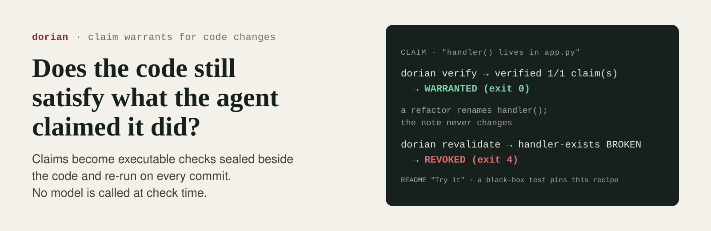

# dorian

**Keep code claims checkable after the next refactor.**

Turn explicit claims into checks sealed beside your code.
Re-run affected checks when their sources change; revoke the warrant when a load-bearing check fails.

**Recorded example:** httpx raised its Python requirement from `>=3.8` to `>=3.9`.
A previously sealed claim became **REVOKED (exit 4)**.
[Captured output + pinned commits](docs/REAL_CATCH_LOG.md) — retrospective reproduction, not deployment evidence.

**Engineering:** [Executable README demo](tests/test_readme_example.py) · [Own-repo warrants](docs/changes/dorian-loop-guard.md.warrant)
[240-pair synthetic benchmark](docs/BENCHMARK_v0.7.0.md) · [Release history](CHANGELOG.md)
Benchmark results are historical; the last recorded rerun was at v1.2.0.

<picture>
  <source media="(prefers-color-scheme: dark)" srcset="docs/assets/hero-dark.svg">
  
</picture>

**Boundary:** a claim is only as strong as its checker.
A symbol-existence check can miss changed behavior. Test and shell checkers execute code.
[Trust and execution limits](docs/SECURITY_BOUNDARY.md)

[Try the runnable demo](#try-it) · [Install](#install) · [GitHub Action](action/README.md)

## Try it

The example below seals a claim, renames its function and reports REVOKED.
It uses a throwaway repository and an isolated environment; Python 3.11+ is required.

```bash
tmp=$(mktemp -d)
cd "$tmp"
python3 -m venv .venv
source .venv/bin/activate
python -m pip install dorian-vwp==1.4.0
git init -q
printf '.venv/\n' > .gitignore

printf 'def handler():\n    return 200\n' > app.py
printf '# change note\n\n`handler()` lives in app.py.\n' > note.md
git add app.py note.md .gitignore
git -c user.name=Demo -c user.email=demo@example.invalid \
  -c commit.gpgsign=false commit -q -m "app + note"

cat > claims.json <<'JSON'
{"claims": [
  {"id": "handler-exists", "text": "handler() lives in app.py.",
   "kind": "reference", "load_bearing": true,
   "checkers": [{"type": "C3", "program": "symbol:app.py::handler"}]}
]}
JSON

dorian verify note.md --claims claims.json     # -> verified 1/1 claim(s)  (exit 0)

# now a refactor renames the function the note claims exists:
printf 'def renamed():\n    return 200\n' > app.py
dorian revalidate --since HEAD                 # -> handler-exists BROKEN; WARRANTED -> REVOKED  (exit 4)
```

`note.md` never changed, but the warrant flips to REVOKED and names the claim whose check failed.
[`tests/test_readme_example.py`](tests/test_readme_example.py) runs the same steps, with the recipe's
command-local Git identity, against this checkout and pins the commands, exit codes and install
version; it does not install from PyPI. For other ways to install, see [Install](#install).

## What it checks and what it does not

Verification makes no model calls (**zero model tokens at check time**); its strength depends on
the claims, checkers and trusted execution environment.

A claim is bound to one of four checker families: **C1** (a quoted span of the artifact itself),
**C3** (a path, symbol, string, or regex in a file, plus the structural `py-signature:` /
`py-const:` / `code:` / `config-value:` forms), **C4** (a `pytest:` node id), or **C5** (typed data
checks on CSV/parquet files, or a `shell:` command). C1, C3, and typed C5 only read files; C4 and C5
`shell:` execute code (see [Security](#security-claims-are-executable-input)). `verify` is
*born-verifiable*: it seals only if every claim holds right now (exit 0) and writes nothing
otherwise (exit 4). A warrant is born **WARRANTED** and folds on each `revalidate` to **TRUSTED**,
**DEGRADED**, **REVOKED**, or **UNKNOWN** (a checker could not run — never counted as broken, never
silently green).

The honest limits:

- **Binding is a re-check trigger, not a behavior proof.** When a claim names a symbol, dorian also
  watches the file that defines it, so an edit there re-checks the claim — but the checker still
  decides truth. A watched file changing never makes a claim BROKEN by itself: binding is trigger
  coverage, **not** behavior proof. Ambiguity is skipped, not guessed — a symbol defined in more than
  one file is left unwatched. Details: [`docs/BINDING.md`](docs/BINDING.md).
- **The gutted-body ceiling.** If a function keeps its name but its behavior changes, an existence
  check (`symbol:`) fires the re-check and passes. Only a behavior checker (a `pytest:` test) on the
  same edit catches it. `--strength-gate` flags load-bearing claims backed only by existence checks.
- It reports whether stated claims are **true against the source** — never whether the code is
  *good*. Not an LLM judge, not an eval framework, not a sandbox.
  Full list: [What dorian is not](docs/OVERVIEW.md#what-dorian-is-not).

## Security: claims are executable input

`dorian verify` *runs* every checker. C1, C3, and typed C5 only read files, but **C4 (`pytest:`) and
C5 `shell:` execute code** — so a `claims.json` or a `.warrant` is executable input. Treat an
agent-emitted `claims.json` like agent-emitted code: review it, and never run `verify` on claims from
an untrusted source. dorian is built for **trusted, internal repositories** — not public CI
taking forked pull requests by default. When you cannot trust the claims, `--deny-exec` (env
`DORIAN_DENY_EXEC=1`) makes the executable families ERROR instead of running (fail-closed, never a
silent pass), and `checker_trust: base` runs only base-approved checker specs on fork PRs. Neither is
a sandbox. See [SECURITY.md](SECURITY.md) and [`docs/SECURITY_BOUNDARY.md`](docs/SECURITY_BOUNDARY.md).

## Install

[](https://github.com/ajaysurya1221/dorian/actions/workflows/ci.yml) [](https://github.com/ajaysurya1221/dorian/releases/latest)
 

The PyPI distribution is `dorian-vwp`; the import and CLI are `dorian`. Python 3.11+, zero runtime
dependencies, trusted publishing (latest: **`v1.4.0`**).

```bash
pip install dorian-vwp             # core
pip install 'dorian-vwp[data]'     # + duckdb for parquet data claims
pip install 'dorian-vwp[extract]'  # + anthropic for LLM claim drafting (frozen/experimental)
```

`dorian init` scaffolds a born-verifiable starter `claims.json`, its change note, and a workflow
file, so the first `dorian verify` seals green:

```bash
cd your-repo
dorian init
dorian verify dorian-change-note.md --claims claims.json   # seals the warrant — exit 0
```

## GitHub Action

The composite [Action](action/README.md) revalidates the claims a pull request touches and posts a
sticky PR comment; with `fail_on: revoked`, a broken load-bearing claim blocks the PR. Read its
[security notes](action/README.md#security-checker-execution-and-untrusted-pull-requests) first.

```yaml
name: dorian
on: [pull_request]

permissions:
  contents: read
  pull-requests: write

jobs:
  revalidate:
    runs-on: ubuntu-latest
    steps:
      - uses: actions/checkout@v6
        with:
          fetch-depth: 0             # revalidate diffs against the PR base sha
          persist-credentials: false # the Action only reads the diff + posts via GITHUB_TOKEN
      - uses: ajaysurya1221/dorian/action@v1.4.0
        with:
          fail_on: revoked
          # install defaults to the published PyPI package (dorian-vwp); pin a
          # version or set a git source spec to install unreleased changes
```

## Using dorian with Claude Code

One command scaffolds a project-local skill: `dorian claude-code install-claim-warrants`. After a
change, `/dorian-claim-warrants` drafts the change note + `claims.json` for the checkable facts the
agent claimed and prints the verify command. **The model drafts; deterministic checkers evaluate the
specified claims.** Review the drafted `claims.json` before running `verify`: C4 and C5 `shell:`
checkers execute code ([Security](#security-claims-are-executable-input)). On later PRs,
`dorian revalidate --since <base>` re-runs the affected checks and revokes a warrant when a
load-bearing check fails. Add `--with-hook` for an opt-in, reminder-only Stop hook. Paste-ready
prompt, runnable example pack, and `settings.json` sample:
[`docs/USE_WITH_CLAUDE_CODE.md`](docs/USE_WITH_CLAUDE_CODE.md) and
[`examples/claude-code/`](examples/claude-code/).

Using dorian inside AI coding loops: `dorian loop preflight --since <base>` re-checks the warrants a
change touched before each iteration and returns `continue` / `repair` / `escalate` — a steering
signal, not a halt ([`docs/DORIAN_LOOP_GUARD.md`](docs/DORIAN_LOOP_GUARD.md)). `dorian governance
install` adds a `SubagentStop` gate and a fail-closed `PreToolUse` veto for unattended runs
([`docs/GOVERNANCE_DATA_MODEL.md`](docs/GOVERNANCE_DATA_MODEL.md)).

## Commands at a glance

`dorian verify <artifact> --claims claims.json` seals a warrant (`--supersede <old-id>` re-seals over
an earlier one, `--no-quotes` writes a content-free sidecar, `--allow-restricted` overrides the
`[tool.dorian.scopes]` seal-time lint). `dorian revalidate --since <ref> --format md` re-checks the
affected claims; `md` is the PR-comment body the Action posts. Also: `dorian status`,
`dorian blast` (downstream warrants are flagged `recalled`), `dorian bindings`,
`dorian suggest-claims` / `suggest-data-checks`, `dorian report --audit`, and the
`dorian bench mutation` / `bench large-mutation` suites (source checkout only). Full reference:
[`docs/COMMANDS.md`](docs/COMMANDS.md).

Exit codes: `0` ok/TRUSTED · `2` usage/infra · `3` DEGRADED · `4` REVOKED/integrity · `5`
ERRORED-only (checkers could not run; never conflated with broken) · `6` scope violation.

## Evidence

On the historical 240-pair synthetic suite, Dorian produced 5 false alarms versus the path-scope watcher's 58, while missing 5 stale pairs that the watcher detected. These results are specific to the authored fixtures.

- **Synthetic benchmark.** Over 240 (artifact, mutation) pairs across six invented fixture domains
  with known-truth labels, claim-level revalidation flagged broken claims at precision **0.93** /
  recall **0.93**, versus file-change watchers at recall 1.00 but precision **0.34** (naive),
  **0.56** (path-scope), and **0.59** (line-aware) — **11.6x** fewer false alarms than the path-scope
  watcher (58 → 5) and **10.4x** fewer than the line-aware one (52 → 5). Synthetic, not your
  repository; measured at v0.7.0 ([`docs/BENCHMARK_v0.7.0.md`](docs/BENCHMARK_v0.7.0.md);
  compatibility notes in [`docs/BENCHMARK_CURRENT.md`](docs/BENCHMARK_CURRENT.md)). Historical
  synthetic result, last rerun at v1.2.0. To reproduce from a source checkout with development
  dependencies installed, run `uv run dorian bench large-mutation`.
- **Retrospective public-repository check.** Revalidating a warrant across two pinned httpx commits
  detected the documented Python-support change. This is a scoped reproduction, not evidence of
  deployment adoption or a prevented production defect. The load-bearing claim was that
  [`encode/httpx`](https://github.com/encode/httpx) declares `requires-python = ">=3.8"`; the upstream
  commit for [#3592](https://github.com/encode/httpx/pull/3592) ("Drop Python 3.8 support") flipped the
  warrant WARRANTED → REVOKED (exit 4). Full output and a from-scratch reproduction:
  [`docs/REAL_CATCH_LOG.md`](docs/REAL_CATCH_LOG.md). One documented case, not universal validation.

**Keep a change note checkable across later edits**

Dorian commits warrants for its own change notes. [The Loop Guard warrant](docs/changes/dorian-loop-guard.md.warrant) includes checks against implementation symbols and selected README text. [Its dogfood test](tests/test_loop_guard_dogfood.py) copies those real files into a temporary repository, seals the claims, then renames a referenced function and checks that the loop decision changes from continue to repair.

This exercises specific authored claims. It does not certify the entire README or establish a current TRUSTED result for every warrant.

## Docs

- [`docs/START_HERE.md`](docs/START_HERE.md) — the docs map, by what you are trying to do.
- [`docs/OVERVIEW.md`](docs/OVERVIEW.md) — the long-form tour, incl. what dorian is not and the roadmap.
- [`docs/COMMANDS.md`](docs/COMMANDS.md) — the full command reference.
- [`docs/BINDING.md`](docs/BINDING.md) — binding semantics: trigger vs. truth.
- [`docs/AGENT_CLAIMS.md`](docs/AGENT_CLAIMS.md) and [`spec/checkers.md`](spec/checkers.md) —
  writing claims; the checker grammar.
- [`docs/BENCHMARK_CURRENT.md`](docs/BENCHMARK_CURRENT.md) — archived benchmark results and
  compatibility notes.
- [`SECURITY.md`](SECURITY.md) and [`docs/SECURITY_BOUNDARY.md`](docs/SECURITY_BOUNDARY.md) — security.
- [`docs/ROADMAP_BACKLOG.md`](docs/ROADMAP_BACKLOG.md) — the structured roadmap backlog.

## Contributing

```bash
git clone https://github.com/ajaysurya1221/dorian.git && cd dorian
make install && make lint && make test
```

Small, focused PRs with tests are welcome. Benchmark contributions carry aggregate numbers only.
Development setup, checks, and conventions: [`CONTRIBUTING.md`](CONTRIBUTING.md).

Maintained by Ajay Surya Senthilrajan, with AI pair-programming recorded in commit trailers.
See the tests, design records and release evidence linked here.

## License

Apache-2.0. Protocol: VWP (Validity Warrant Protocol), spec in [`spec/`](spec/).
Author: Ajay Surya Senthilrajan ([@ajaysurya1221](https://github.com/ajaysurya1221)).
