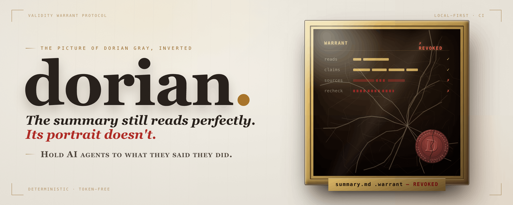

<div align="center">

<picture>
  <source media="(prefers-color-scheme: dark)" srcset="docs/assets/dorian-hero.png">
  <source media="(prefers-color-scheme: light)" srcset="docs/assets/dorian-hero-light.png">
  
</picture>

# dorian

**Hold AI agents to what they said they did.**

*The summary still reads perfectly. Its portrait doesn't.*

<p>
  <a href="#install"></a>
  <a href="#try-it-in-30-seconds"></a>
  <a href="action/README.md"></a>
</p>

<p>
  <a href="https://github.com/ajaysurya1221/dorian/actions/workflows/ci.yml"></a>
  
  
  <a href="https://github.com/ajaysurya1221/dorian/releases/latest"></a>
</p>

</div>

`dorian` holds an AI coding agent to what it *said* it did. The agent (or you) writes a `claims.json`
of checkable claims about a change — "`handler()` lives in `app.py`", "the login timeout is 30
seconds", "`test_login_ratelimit` passes". `dorian verify` turns each claim into a deterministic
check, runs it against the real code, and seals the result beside the code in a git-committed
`.warrant` sidecar. On every later commit, `dorian revalidate` re-runs only the checks whose watched
files changed and flips the warrant to **REVOKED** the moment a claim stops being true — naming the
claim. No model is called at verification time (**zero model tokens at check time**), so the checker
cannot be talked past by the code it verifies. It ships as a CLI, a GitHub Action, and Claude Code
hooks, with **zero runtime dependencies**.

## Try it in 30 seconds

A self-contained run on a throwaway repo — copy-paste it; it leaves nothing behind but a
temp directory. (A black-box test pins this exact sequence, so it stays runnable.)

```bash
tmp=$(mktemp -d) && cd "$tmp" && git init -q
printf 'def handler():\n    return 200\n' > app.py
printf '# change note\n\n`handler()` lives in app.py.\n' > note.md
git add -A && git commit -q -m "app + note"

cat > claims.json <<'JSON'
{"claims": [
  {"id": "handler-exists", "text": "handler() lives in app.py.",
   "kind": "reference", "load_bearing": true,
   "checkers": [{"type": "C3", "program": "symbol:app.py::handler"}]}
]}
JSON

dorian verify note.md --claims claims.json     # -> verified 1/1 claim(s)  (exit 0)

# now a refactor renames the function the note claims exists:
printf 'def renamed():\n    return 200\n' > app.py
dorian revalidate --since HEAD                 # -> handler-exists BROKEN; WARRANTED -> REVOKED  (exit 4)
```

`note.md` never changed and `git`/CI stay quiet — but the warrant flips to REVOKED, naming
the exact claim that stopped being true. (Don't have `dorian` yet? See
[Install](#install).)

## What it checks and what it does not

A claim is bound to one of four read-only checker families: **C1** (a quoted span of the artifact
itself), **C3** (a path, symbol, string, or regex in a file, plus the structural `py-signature:` /
`py-const:` / `code:` / `config-value:` forms), **C4** (a `pytest:` node id), or **C5** (typed data
checks on CSV/parquet files, or a `shell:` command). `verify` is *born-verifiable*: it seals only if
every claim holds right now (exit 0) and writes nothing otherwise (exit 4). A warrant is born
**WARRANTED** and folds on each `revalidate` to **TRUSTED**, **DEGRADED**, **REVOKED**, or **UNKNOWN**
(a checker could not run — never counted as broken, never silently green).

The honest limits:

- **Binding is a re-check trigger, not a behavior proof.** When a claim names a symbol, dorian also
  watches the file that defines it, so an edit there re-checks the claim — but the checker still
  decides truth. A watched file changing never makes a claim BROKEN by itself: binding is trigger
  coverage, **not** behavior proof. Ambiguity is skipped, not guessed — a symbol defined in more than
  one file is left unwatched. Details: [`docs/BINDING.md`](docs/BINDING.md).
- **The gutted-body ceiling.** If a function keeps its name but its behavior changes, an existence
  check (`symbol:`) fires the re-check and passes. Only a behavior checker (a `pytest:` test) on the
  same edit catches it. `--strength-gate` flags load-bearing claims backed only by existence checks.
- It reports whether stated claims are **true against the source** — never whether the code is
  *good*. Not an LLM judge, not an eval framework, not a sandbox.
  Full list: [What dorian is not](docs/OVERVIEW.md#what-dorian-is-not).

## Security: claims are executable input

`dorian verify` *runs* every checker. C1, C3, and typed C5 only read files, but **C4 (`pytest:`) and
C5 `shell:` execute code** — so a `claims.json` or a `.warrant` is executable input. Treat an
agent-emitted `claims.json` like agent-emitted code: review it, and never run `verify` on claims from
an untrusted source. dorian is built for **trusted, internal repositories** — not public CI
taking forked pull requests by default. When you cannot trust the claims, `--deny-exec` (env
`DORIAN_DENY_EXEC=1`) makes the executable families ERROR instead of running (fail-closed, never a
silent pass), and `checker_trust: base` runs only base-approved checker specs on fork PRs. Neither is
a sandbox. See [SECURITY.md](SECURITY.md) and [`docs/SECURITY_BOUNDARY.md`](docs/SECURITY_BOUNDARY.md).

## Install

The PyPI distribution is `dorian-vwp`; the import and CLI are `dorian`. Python 3.11+, zero runtime
dependencies, trusted publishing (latest: **`v1.4.0`**).

```bash
pip install dorian-vwp             # core
pip install 'dorian-vwp[data]'     # + duckdb for parquet data claims
pip install 'dorian-vwp[extract]'  # + anthropic for LLM claim drafting (frozen/experimental)
```

`dorian init` scaffolds a born-verifiable starter `claims.json`, its change note, and a workflow
file, so the first `dorian verify` seals green:

```bash
cd your-repo
dorian init
dorian verify dorian-change-note.md --claims claims.json   # seals the warrant — exit 0
```

## GitHub Action

The composite [Action](action/README.md) revalidates the claims a pull request touches and posts a
sticky PR comment; with `fail_on: revoked`, a broken load-bearing claim blocks the PR. Read its
[security notes](action/README.md#security-checker-execution-and-untrusted-pull-requests) first.

```yaml
name: dorian
on: [pull_request]

permissions:
  contents: read
  pull-requests: write

jobs:
  revalidate:
    runs-on: ubuntu-latest
    steps:
      - uses: actions/checkout@v6
        with:
          fetch-depth: 0             # revalidate diffs against the PR base sha
          persist-credentials: false # the Action only reads the diff + posts via GITHUB_TOKEN
      - uses: ajaysurya1221/dorian/action@v1.4.0
        with:
          fail_on: revoked
          # install defaults to the published PyPI package (dorian-vwp); pin a
          # version or set a git source spec to install unreleased changes
```

## Using dorian with Claude Code

One command scaffolds a project-local skill: `dorian claude-code install-claim-warrants`. After a
change, `/dorian-claim-warrants` drafts the change note + `claims.json` for the checkable facts the
agent claimed and prints the verify command — **the model only drafts; `dorian verify` proves**.
`dorian revalidate --since <base>` on later PRs REVOKEs whatever the code drifted away from. Add
`--with-hook` for an opt-in, reminder-only Stop hook. Paste-ready prompt, runnable example pack, and
`settings.json` sample: [`docs/USE_WITH_CLAUDE_CODE.md`](docs/USE_WITH_CLAUDE_CODE.md) and
[`examples/claude-code/`](examples/claude-code/).

Using dorian inside AI coding loops: `dorian loop preflight --since <base>` re-checks the warrants a
change touched before each iteration and returns `continue` / `repair` / `escalate` — a steering
signal, not a halt ([`docs/DORIAN_LOOP_GUARD.md`](docs/DORIAN_LOOP_GUARD.md)). `dorian governance
install` adds a `SubagentStop` gate and a fail-closed `PreToolUse` veto for unattended runs
([`docs/GOVERNANCE_DATA_MODEL.md`](docs/GOVERNANCE_DATA_MODEL.md)).

## Commands at a glance

- `dorian verify <artifact> --claims claims.json` — run every checker and seal the `.warrant`
  (born-verifiable). `--supersede <old-id>` re-seals over an earlier warrant, `--no-quotes` writes a
  content-free sidecar, `--allow-restricted` overrides the `[tool.dorian.scopes]` seal-time lint.
- `dorian revalidate --since <ref> --format md` — re-check only the claims whose watched files
  changed; `md` is the PR-comment body the Action posts.
- `dorian status <artifact>` · `dorian blast <artifact>` — trust state; downstream warrants, which
  are flagged `recalled` when a claim they build on breaks.
- `dorian bindings <artifact>` · `dorian bind-suggest --claims claims.json` · `dorian rebind` —
  binding diagnostics, a preview of the files `verify` would auto-bind, re-derived watches.
- `dorian suggest-claims <file.py>` · `dorian suggest-data-checks <data-file>` — born-verifiable
  claim and C5 checker suggestions to paste into `claims.json`.
- `dorian report --audit` — the event log as byte-identical JSONL.
- `dorian bench mutation` · `bench large-mutation` · `bench binding-lifecycle` · `bench public-repos`
  — the reproducible benchmark suites.

Exit codes: `0` ok/TRUSTED · `2` usage/infra · `3` DEGRADED · `4` REVOKED/integrity · `5`
ERRORED-only (checkers could not run; never conflated with broken) · `6` scope violation.
Full reference: [`docs/COMMANDS.md`](docs/COMMANDS.md).

## Evidence

- **Synthetic benchmark.** Over 240 (artifact, mutation) pairs across six invented fixture domains
  with known-truth labels, claim-level revalidation flagged broken claims at precision **0.93** /
  recall **0.93**, versus file-change watchers at recall 1.00 but precision **0.34** (naive),
  **0.56** (path-scope), and **0.59** (line-aware) — **11.6x** fewer false alarms than the path-scope
  watcher (58 → 5) and **10.4x** fewer than the line-aware one (52 → 5). Synthetic, not your
  repository; measured at v0.7.0 and **historical** — last re-run, unchanged, at v1.2.0
  ([`docs/BENCHMARK_CURRENT.md`](docs/BENCHMARK_CURRENT.md),
  [`docs/BENCHMARK_v0.7.0.md`](docs/BENCHMARK_v0.7.0.md)). Reproduce: `dorian bench large-mutation`.
- **One real catch.** A load-bearing claim sealed against [`encode/httpx`](https://github.com/encode/httpx)
  — `requires-python` is `">=3.8"` — was flipped WARRANTED → REVOKED (exit 4) by a later upstream PR
  ([#3592](https://github.com/encode/httpx/pull/3592), "Drop Python 3.8 support") while httpx's own
  test suite stayed green. Full output and a from-scratch reproduction:
  [`docs/REAL_CATCH_LOG.md`](docs/REAL_CATCH_LOG.md). One documented catch — evidence, not universal
  validation.

## Docs

- [`docs/START_HERE.md`](docs/START_HERE.md) — the docs map, by what you are trying to do.
- [`docs/OVERVIEW.md`](docs/OVERVIEW.md) — the long-form tour, incl. what dorian is not and the roadmap.
- [`docs/COMMANDS.md`](docs/COMMANDS.md) — the full command reference.
- [`docs/BINDING.md`](docs/BINDING.md) — binding semantics: trigger vs. truth.
- [`docs/AGENT_CLAIMS.md`](docs/AGENT_CLAIMS.md) and [`spec/checkers.md`](spec/checkers.md) —
  writing claims; the checker grammar.
- [`docs/BENCHMARK_CURRENT.md`](docs/BENCHMARK_CURRENT.md) — current-version benchmark reruns.
- [`SECURITY.md`](SECURITY.md) and [`docs/SECURITY_BOUNDARY.md`](docs/SECURITY_BOUNDARY.md) — security.
- [`docs/ROADMAP_BACKLOG.md`](docs/ROADMAP_BACKLOG.md) — the structured roadmap backlog.

## Contributing

```bash
git clone https://github.com/ajaysurya1221/dorian.git && cd dorian
make install && make lint && make test
```

Small, focused PRs with tests are welcome. Benchmark contributions carry aggregate numbers only.

## License

Apache-2.0. Protocol: VWP (Validity Warrant Protocol), spec in [`spec/`](spec/).
Author: Ajay Surya Senthilrajan ([@ajaysurya1221](https://github.com/ajaysurya1221)).
